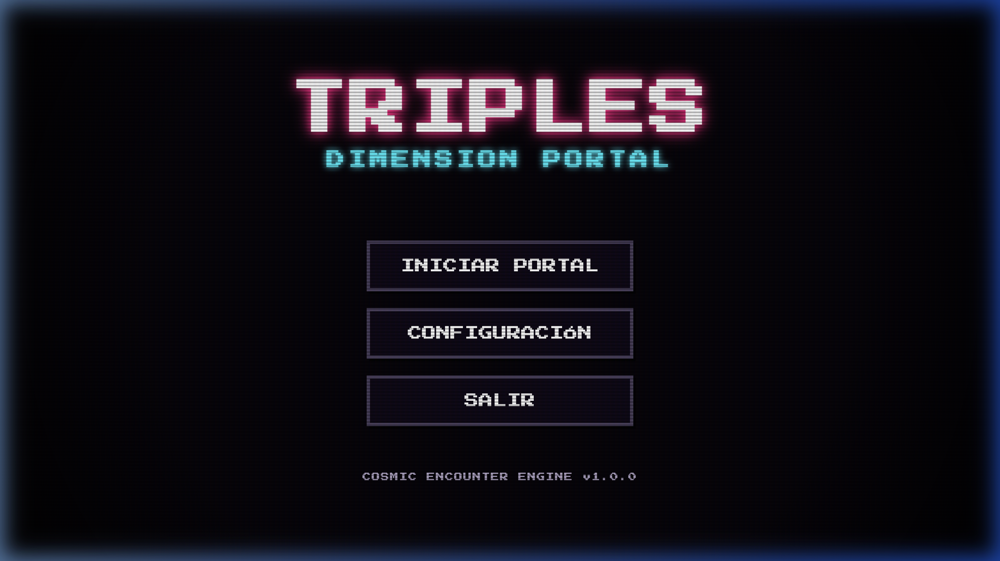
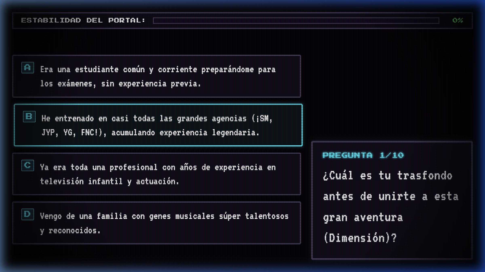
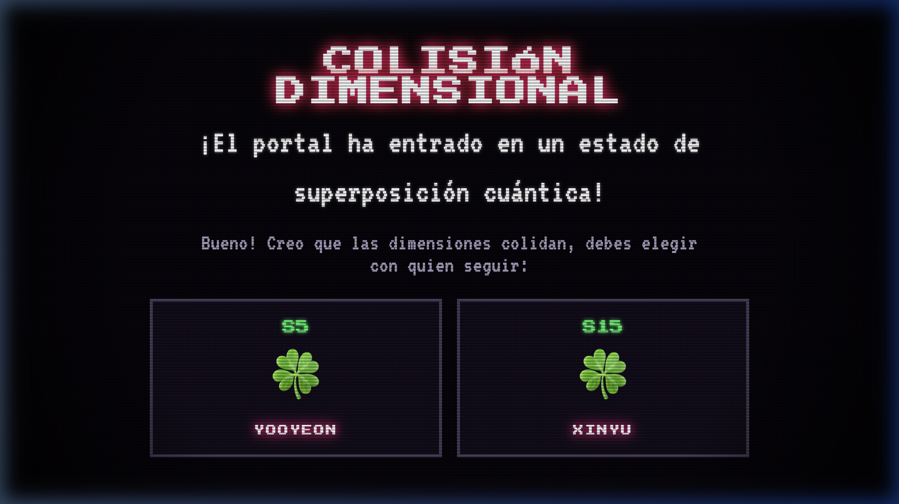
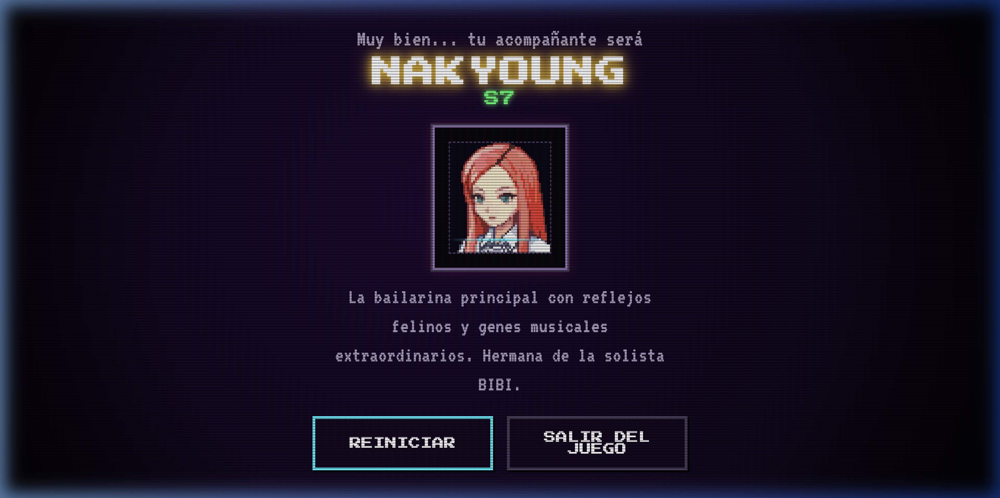

# 🌌 tripleS: Dimension Portal - Idle RPG Card Game

Welcome to the **tripleS: Dimension Portal** project, an immersive web-based idle RPG card game centered around the concept of tripleS and their digital collectibles (Objekts/Cards). Players navigate through dimensional gates, assemble decks composed of different members and sub-units, and embark on passive idle missions to stabilize the multiverse.

---

## 📺 Gameplay & Visuals

Here is a preview of the interactive onboarding gates, settings panel, and character results screen:

### Key Screens
| Main Menu | Questionnaire |
|---|---|
|  |  |

| Tie-Breaker (Dimensional Collision) | Character Synced |
|---|---|
|  |  |

---

## 🔮 Core Game Concept
The game combines RPG progression mechanics with card collection elements:
- **Character Selection Questionnaire**: An interactive intro sequence that queries the player's preferences and background to assign their starting tripleS companion.
- **Objekts Deck Building**: Decks are populated with members from S1 to S24, triggering synergy bonuses when specific sub-units (Acid Angel from Asia, +(KR)ystal Eyes, Aria, Visionary Vision) are united.
- **WebGL Cosmic Portals**: Immersive backgrounds animated with custom fragment shaders mapping the chaotic dimension-hopping journey of the group.
- **Idle Missions**: Decks run automated encounters, earning experience points and securing new card drops.

---

## 🚀 Technologies Used
- **Core Architecture**: HTML5 semantic markup and Vanilla JavaScript state controllers.
- **WebGL Shader Engine**: Custom, highly optimized GLSL fragment shader rendering the animated cosmic gas clouds and blinking star fields in real-time.
- **Web Audio Synth**: A self-contained sound effects engine utilizing the browser's native **Web Audio API** to compile classic arcade sweeps and chimes programmatically.
- **Retro Styling (CSS)**: Double pixel-art borders, glowing neon headers, text glitch animations, and a retro CRT screen overlay (scanlines, vignettes, and pixel flickering).
- **Aesthetic Typography**: Google Fonts integration using `Press Start 2P` (headers and interfaces) and `VT323` (readable terminal dialogue).

---

## 🤖 AI Co-Piloted Agent Development
This project is built using advanced agentic pair-programming workflows, co-created by the user alongside **Antigravity IDE** (developed by Google DeepMind) and **Claude**. 

The repository integrates specialized tools, documentation workflows, and skills designed to enhance the AI's autonomous capability to understand, plan, and audit game features:

### 🌐 Context7 Model Context Protocol (MCP)
The project utilizes **Context7** via the Model Context Protocol (MCP) to dynamically resolve library IDs and query documentation in real-time. This ensures that the agents always construct features using the latest standards and specifications (such as WebGL GLSL constraints, Web Audio contexts, and pixel-art rendering).

### 📋 Workflows and Commands (`commands/`)
Local workflow instructions are stored in the [commands/](file:///Users/ignaciorojas/Documents/repos/ia_rpg_card_game/commands/) directory to guide agents and developers during development:
- **[`code-quality.md`](file:///Users/ignaciorojas/Documents/repos/ia_rpg_card_game/commands/code-quality.md)**: Establishes the step-by-step auditing procedure to evaluate code styling, shader validation, and audio resilience using Context7 query tools.

### Integrated Agent Skills (`.agents/skills/`)
1. **[`game-engine`](file:///.agents/skills/game-engine/SKILL.md)**: Exposes advanced reference documentation, algorithms (noise, collisions, math), and baseline templates for HTML5 Canvas and raw WebGL rendering loops.
2. **[`game-development`](file:///.agents/skills/game-development/SKILL.md)**: Coordinates gaming frameworks, design principles, multiplayer systems, audio synthesis, and sub-genre guidelines (2D, 3D, mobile, and web).
3. **[`game-ui-design`](file:///.agents/skills/game-ui-design/SKILL.md)**: Governs visual interface standards, controller bindings, layout layouts (HUDs), diegetic components, and esports readability rules.
4. **[`modern-javascript-patterns`](file:///.agents/skills/modern-javascript-patterns/SKILL.md)**: Provides a set of best practices and reference guidelines for ES6+ modern JavaScript coding paradigms.

These configurations are utilized by the agent at runtime to align with the workspace's architecture.

---

## 🎮 How to Play / Run Locally
Since the game runs on native browser APIs, you only need to serve the root directory using any local web server:

**Option A: Python server**
```bash
python3 -m http.server 8000
```

**Option B: Node.js server**
```bash
npx serve -l 8000 ./
```

Open your browser and navigate to:
👉 **[http://localhost:8000](http://localhost:8000)**
